# Matt Lloyd Writes Website

This project is a portfolio website for an author to provide information about themselves and their books, aimed at both current fans and potential future readers. It is designed to work responsively across a range of devices and screen resolutions.

View the live project [here](https://mlgranger540.github.io/milestone-1/).

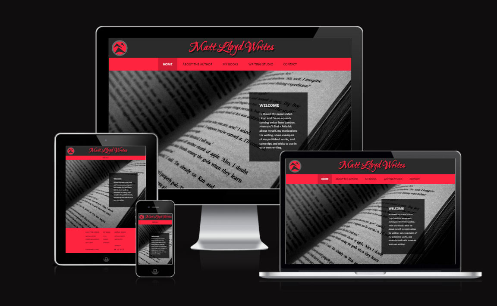

---

## UX

### Goals

- Goals for new visitors – to find out about the author and their writing, learn about their books and gauge their interest in reading them, get writing tips from the author, and join the author’s mailing list

- Goals for return visitors – to find out about any new books, return to writing tips

- Goals for author – publicity, gain readership for their work, promote/sell their books, build connection with existing fans by sharing personal details and writing history, help inspire and develop the skills of future writers

---

## Features

### Title and Logo

The header of my site includes a simple title and logo to immediately inform the user what website they are visiting. The logo was created myself using a digital art software, and the title uses a Google font called Ruthie. Both of these, when clicked/tapped, function as links back to the homepage.

### Navbar

Beneath the title and logo is the navigation bar, which has links to all the pages of the site. The active page is highlighted with a darker background and white font color, so users know which page they are on. These styles are also applied when the links are hovered over, as well as applying an underline to the links, to make it clear to users that these are clickable links.

On smaller resolution devices, the navbar is collapsed down into a drop-down menu bar that toggles on and off on click, in order to minimise the space taken up on the screen and improve user experience for mobile users.

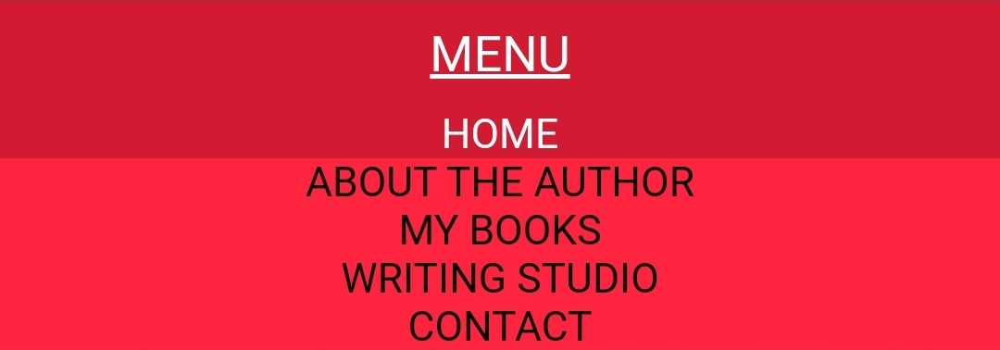

### Favicon

The logo also displays as a favicon in the browser tab, helping to indicate to a user which tab is which when multiple tabs are open.

### Welcome Page

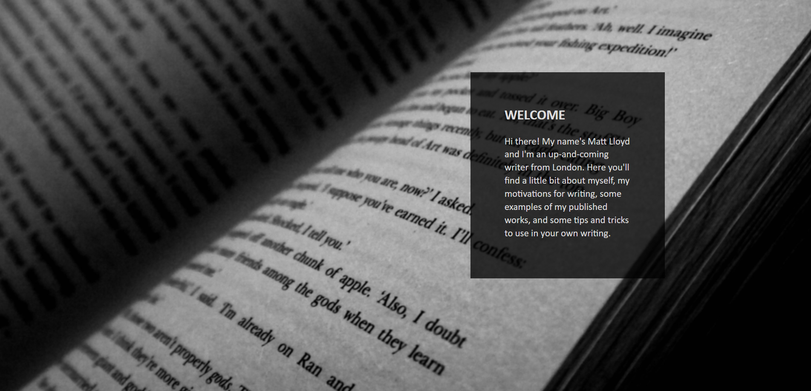

The homepage consists of a large black and white hero image of a book, with a transparent welcome card displayed over the top. The image straightaway allows the reader to get an idea of the kind of website they are visiting, and the card provides a brief but descriptive introduction to the author of the site and what content the rest of the site will contain. This image has a slight blur applied to it to ensure the image does not distract from the text.

### About the Author

Page 2 begins with a hero image of the author and a profile card giving a short introduction. This image also has a blur effect applied for the same reason as above.

Below this are three panels that give a summary of the author's writing history, the genres and audience they write for, and what motivates them to write. These are split into three colums on larger screen resolutions to allow the information to be more easily digested.

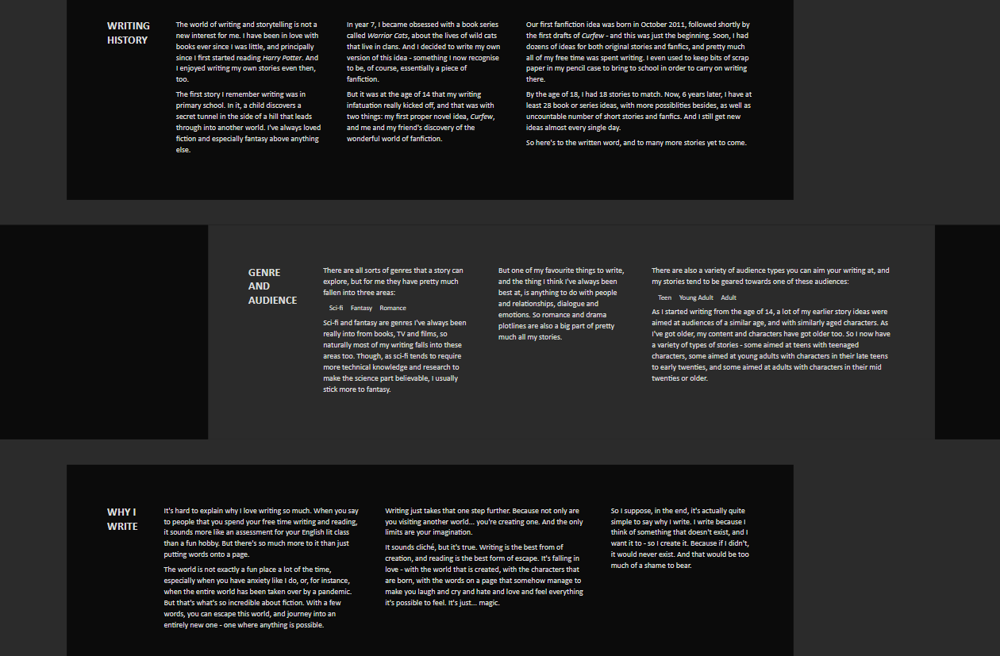

### My Books

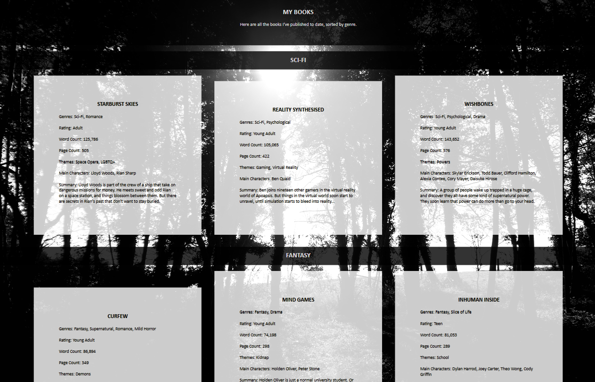

The third page consists of a rundown of the author's books, organised onto three 'bookshelves', one for each genre. There are three books on each shelf, which each include the books' genres, rating, word and page count, themes, main characters, and a summary of the book. They are displayed in partially transparent white panels over a black and white background image of a forest, with enough contrast that the text is still easily read.

On mobile these books are displayed in a stack rather than side by side.

### Writing Studio

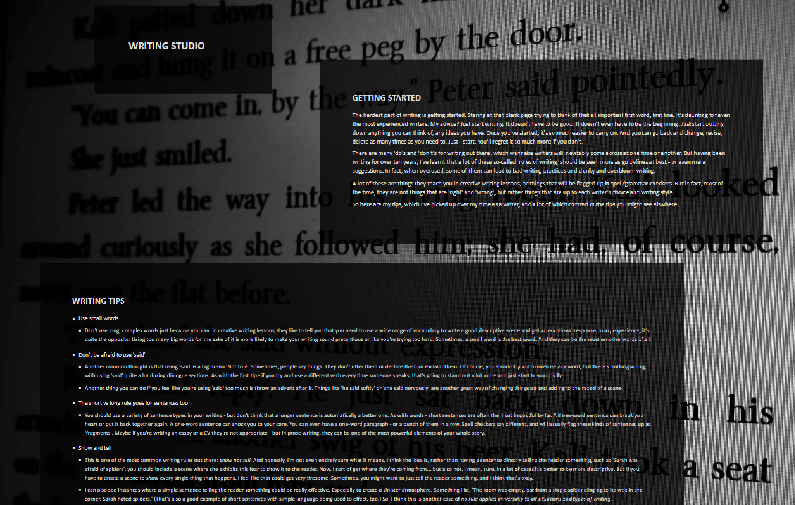

The fourth page is a writing studio, containing tips from the author on how to get started as a writer and how to improve your writing. They are displayed over a background image of some of the author's own writing.

### Contact

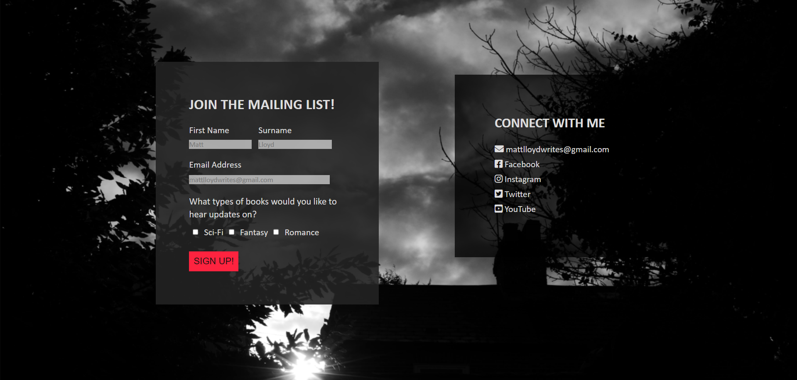

The last page contains a form to sign up to the author's mailing list, including first name, surname, email, and checkboxes to determine which books the user would like to receive email updates on. There is also a contact card with links to email and social media, which all open in a new tab when clicked. On mobile the two cards stack rather than display side by side.

### Footer

The footer of the site contains a navigation tree to all the sub-sections of the site pages, as well as social media buttons and a copyright notice. The nav links all display an underline on hover, and will take a user directly to that section of the relevant page. The social media buttons open their links in a new tab.

On smaller resolutions, the contact section of the footer drops down below the writing studio links, to make the display more compact for smaller devices.

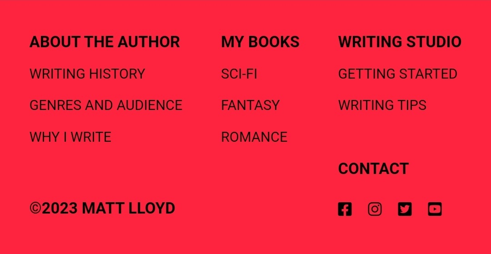

### Features to Add

- Gallery of Images - This was a feature I wanted to add, but didn't have time for in the end. I would have included a gallery of related images, such as pictures of the author, books and writing-related images, and possibly supporting art for the books such as cover art and character designs.

- Bookshelf Carousel on Mobile - This is another feature I would've liked to add. Rather than having to scroll down to all of the books on mobile devices, users could scroll left and right across the 'bookshelf' to see each book on that shelf.

- Book Cover Images - I also would've liked to potentially have the books on page 3 display with book cover images, and maybe if clicked or swiped on, the info for that book would be revealed.

- News/Blog Page - Another possible idea was to have a news or blog page for the author to give updates on things like their daily life, current works in progress, new books published or new editions coming out.

---

## Design

The initial design of the project was mapped out with Wireframes using a program called [Justinmind](https://www.justinmind.com/).

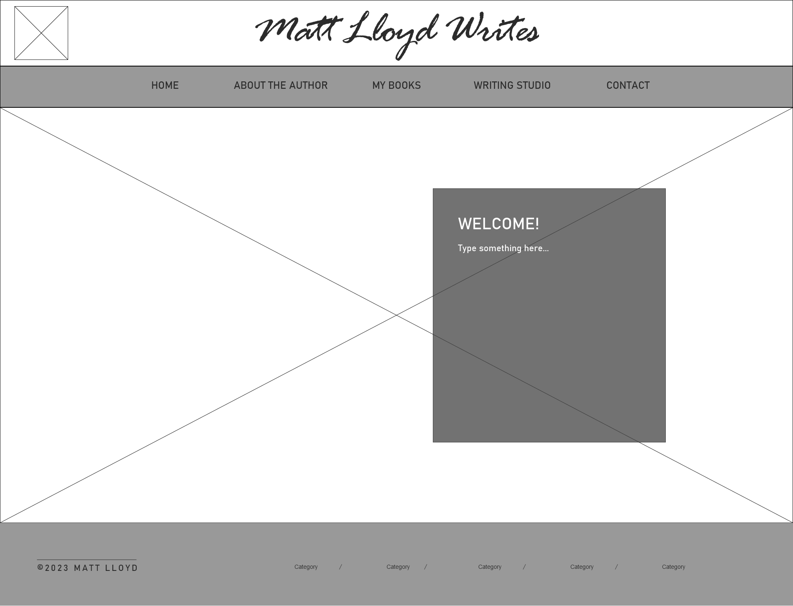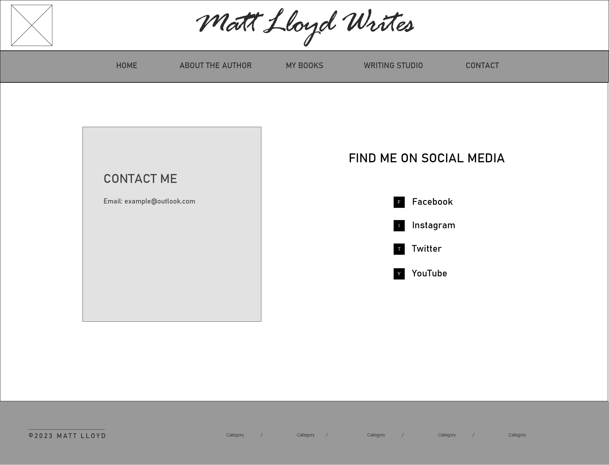
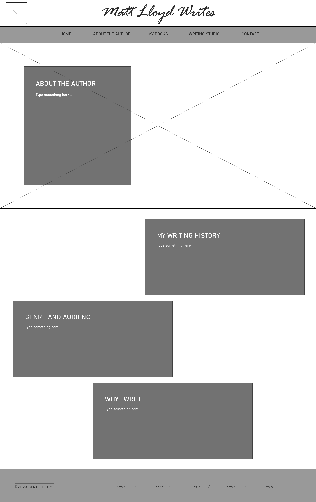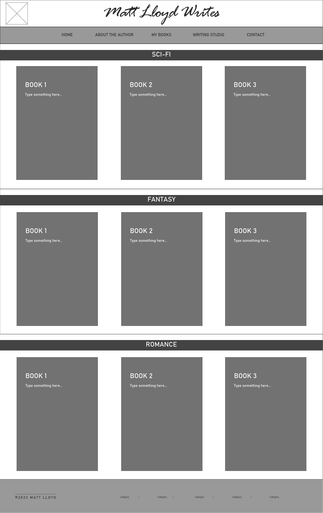
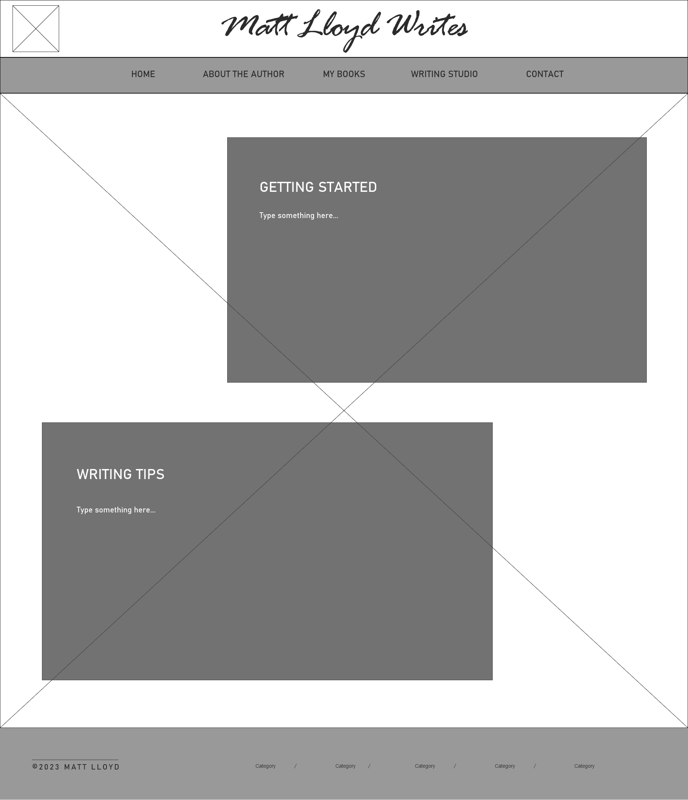

I then used these as a basis to build the structure of the final project with HTML and CSS.

The colour scheme of the final site is a simple black and white with a highlight red colour to draw the eye. I also included black and white hero/background images, with a blur effect on some pages, to add to the design of the site while not detracting from the text.

---

## Technologies

### Languages

- HTML5
- CSS3
- JavaScript for the collapsible navbar

### Frameworks, Libraries and External Stylesheets

- [Git](https://git-scm.com/) for version control
- [GitHub](https://github.com/) to store the project repository and back up git commits
- [Google Fonts](https://fonts.google.com/) for the title font
- [Font Awesome](https://fontawesome.com/) for the social media icons
- [Justinmind](https://www.justinmind.com/) to create the wireframes
- [Clip Studio Paint](https://www.clipstudio.net/en/) to design the logo

---

## Testing

### User Experience

- All links have been thoroughly tested to ensure they work and go to the correct locations
- The title of page tabs correctly indicate which page the user is on
- Hover feature on the navbar changes the background colour and font colour of the element, as well as adding an underline to links in the navbar and footer, making it clear which links are clickable
- Active tab is correctly highlighted so user knows where they are on the site
- Load times of images were initially quite slow, so I used image optimising tools to compress the images, improving the load times and therefore the user experience
- Originally, the title and logo were not clickable links - after feedback from a tester who said they expected this to be the case, I made both of these into links back to home
- I added favicons following feedback from another tester to make it clear which tab is which on a browser

### Responsiveness

The project was tested on various devices and screen resolutions, by using Chrome Dev Tools during development as well as testing the deployed site on a variety of desktop and mobile devices from around 320px to 4K resolution.

- All aspects of the site including images and fonts resize/reposition according to the screen size, allowing for a fully responsive experience
- To improve responsiveness on mobile devices, I added a collapsible navbar for resolutions under 768px to avoid this taking up room on the page
- I made the text of the about panels into columns on bigger resolutions as this made it easier to digest the text
- I removed the background on page 4 on mobile as at these resolutions the image became stretched/blown up and was detracting from the appearance of the page
- I also adjusted the zoom/sizing of the image on page 5 to avoid stretching/gaps on different resolutions

### Compatibility

I also tested the project on Google Chrome, Firefox, Microsoft Edge and Safari to ensure that the website worked well on all browsers.

- There was an issue with menu button not inheriting colour on Safari, which has been fixed by adding the text-decoration-color: inherit; and -webkit-text-decoration-color: inherit; properties to the CSS
- There was also an issue with the sizing of the title on some mobile devices, specifically iOS devices (Chrome and Safari) and Firefox mobile users. The characters appear more spaced out, leading the title to display on two lines, where on other mobile devices/browsers it displays on one. I tried a couple of fixes using the -webkit-text-size-adjust property, but couldn't solve the issue. One solution would have been to reduce the font size further, but in order to reduce it enough to display properly on iPhones and Firefox mobile, it would have been way too small on other mobile devices and browsers. So as the issue doesn't severely impact the overall experience of using the site, I decided to leave it.

### Validation

All HTML pages passed through the [W3C validator](https://validator.w3.org/) with no issues. Each page was checked by direct input as well as by running the whole site through the validator via its URI.

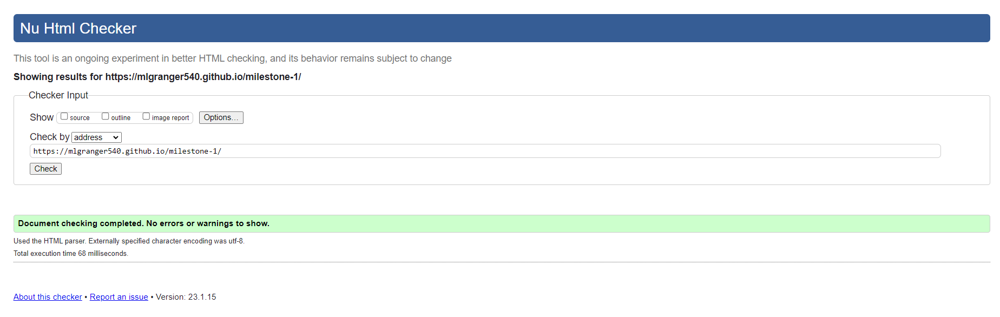

CSS passed through the [Jigsaw validator](https://jigsaw.w3.org/css-validator/) with no issues. CSS was checked by direct input as well as via the site URI.

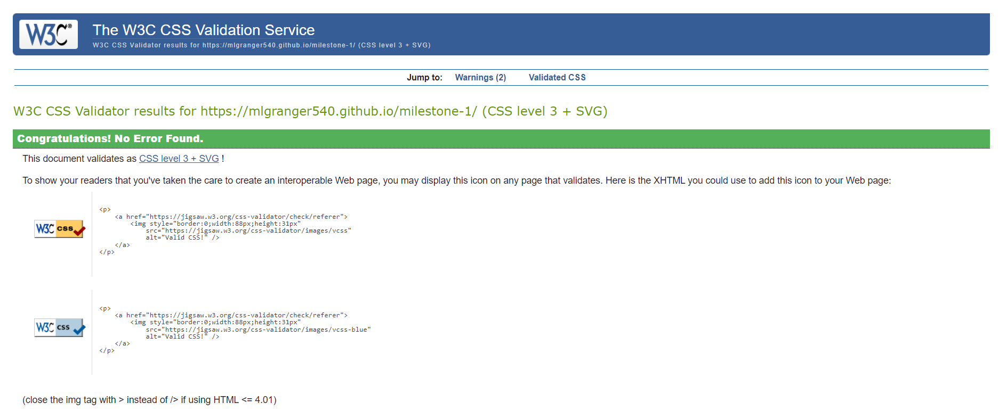

### Accessibility

[WAVE](https://wave.webaim.org/) was used to assess the accessbility of the website.

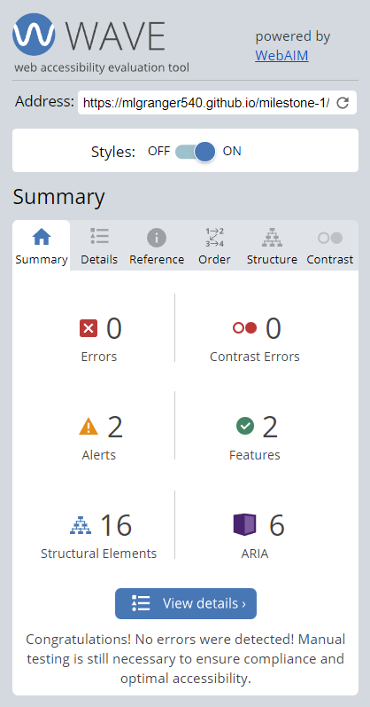

- No errors were detected, although it notes that I have two adjacent links to the same location, in the title and the home link in the navbar, and says these should be combined if possible to avoid excess navigation for screen reader and keyboard users. But as these were added in due to feedback from a tester, and couldn't really be combined, I had to leave them in.
- Aria labels were used on the title and logo links and social media buttons in the footer and on the contact page, including the note that the latter open in a new tab, to help with navigation of the site for screen reader users.
- No contrast issues were found.

### Known Bugs

- Title letter spacing issue on some mobile devices/browsers still causes the title to drop onto two lines
- Hover/active box was hanging below the navbar onto the image on pages 3-5 at certain resolutions - partially fixed by changing the background images to position: relative, now the overhang is covered by the image but still there and can be seen before the image loads
- Load times of the images are still a little slow, but further compression would've resulted in loss of quality/reducing the resolution of the images and therefore led to a poor appearance of the site
- Slight line appears above and below the genre and audience panel on the about page but seemingly only on Chrome Dev Tools at 4K resolution, as this couldn't be seen when viewing the deployed site on a 4K monitor

---

## Deployment

The project was deployed to GitHub Pages by going to the settings of the repository on GitHub, going to the pages section, and deploying from branch main.

The project can be cloned by using [this link](https://github.com/mlgranger540/milestone-1.git) with the `git clone` command.

---

## Credits

### Code

- The Love Running project inspired the zoom animation on the hero images on page 1 and 2
- I used the code structure [here](https://jsfiddle.net/03p6wsjb/14) to get the contact section of the footer to drop below the writing studio section on smaller resolutions
- I learned about the box-sizing: border-box property from these [[1](https://stackoverflow.com/questions/16907518/css-input-with-width-100-goes-outside-parents-bound), [2](https://stackoverflow.com/questions/36137640/css-input-element-width-going-outside-container)] stackoverflow posts, when padding was causing some of my elements to exceed 100% width
- [This](https://stackoverflow.com/questions/51181010/text-decoration-line-through-css-does-not-work-on-safari-with-my-completed-cla) stackoverflow post helped solve the issue of colour not inheriting on Safari
- I attempted the fixes [here](https://stackoverflow.com/questions/3226001/some-font-sizes-rendered-larger-on-safari-iphone/3428477#3428477) when trying to solve the issue of the title letter spacing appearing bigger on certain mobile devices/browsers, but they didn't solve my issue

### Content

- All text content was written by me

### Media

- All photos and images were taken or created by me
- [Google fonts](https://fonts.google.com/) for the title font
- [Font Awesome](https://fontawesome.com/) for the social media icons
- Favicons were generated with [favicon.io](https://favicon.io/)

### Acknowledgements

- My family and friends for testing the deployed project and providing feedback as well as detailing any bugs found - special mention to Ben for going above and beyond!
- My tutor Michael and mentor Antonio for their support and guidance